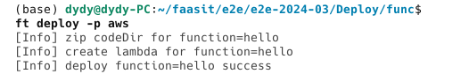
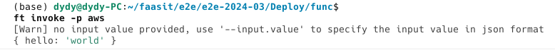
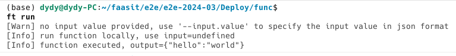
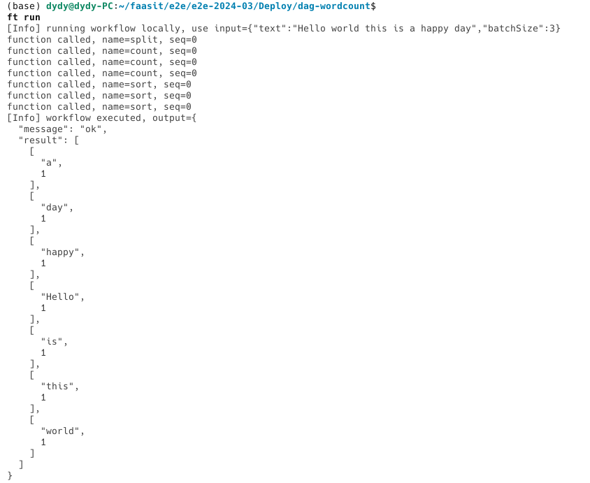

## 功能测试

> 测试后记得删掉原来的测试环境

- 阿里云函数部署

```bash
cd func && ft deploy -p Aliyun
```


- 阿里云函数更新

```bash
cd func && ft deploy -p Aliyun
```

- 阿里云函数流部署

```bash
cd dag-wordcount && ft deploy -p Aliyun
```


- 阿里云函数流更新

```bash
cd dag-wordcount && ft deploy -p Aliyun
```


- AWS 函数部署

```bash
cd func && ft deploy -p aws
```



- AWS 函数更新

```bash
cd func && ft deploy -p aws
```


- 本地函数部署

```bash
cd func && ft deploy -p Local
```


- 本地函数流部署

```bash
cd dag-wordcount && ft deploy -p Local
```


---

- 阿里云函数调用

```bash
cd func && ft invoke -p Aliyun
```

- 阿里云函数流调用

```bash
cd dag-wordcount && ft invoke -p Aliyun -f __executor
```


- AWS 函数调用

```bash
cd func && ft invoke -p aws
```




- 本地函数调用


```bash
cd func && ft invoke -p Local
```


- 本地函数流调用

```bash
ft invoke -p Local -f executor
```


---
- 触发器部署

```bash
cd trigger && ft deploy
```


- 触发器更新

```bash
cd trigger && ft deploy
```


---

- 本地`javascript`函数运行

```bash
cd func && ft run
```




- 本地`javascript`函数流运行

```bash
cd dag-wordcount && ft run
```



- 本地`python`函数运行

```bash
cd python/demo1 && ft run
```


- 本地`python`函数流执行

```bash
cd python/demo2 && ft run
```

