## 功能测试

- 阿里云函数部署

```bash
cd func && ft deploy -p Aliyun
```

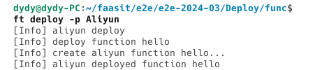

- 阿里云函数更新

```bash
cd func && ft deploy -p Aliyun
```

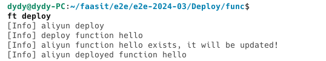

- 阿里云函数调用

```bash
cd func && ft invoke -p Aliyun
```

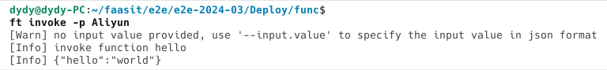


- 阿里云函数流部署

```bash
cd dag-wordcount && ft deploy -p Aliyun
```

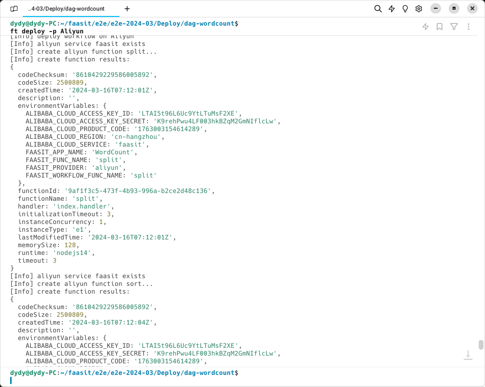

- 阿里云函数流更新

```bash
cd dag-wordcount && ft deploy -p Aliyun
```

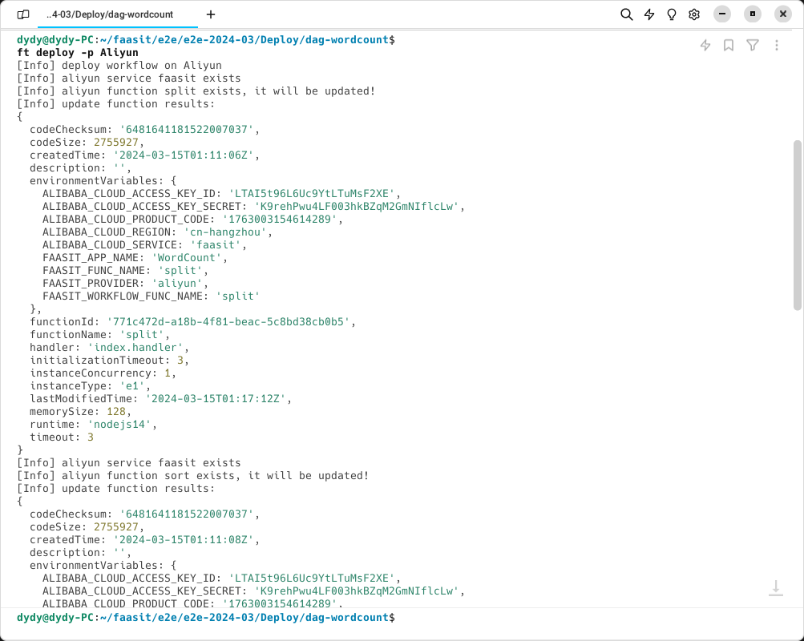

- 阿里云函数流调用

```bash
cd dag-wordcount && ft invoke -p Aliyun -f __executor
```

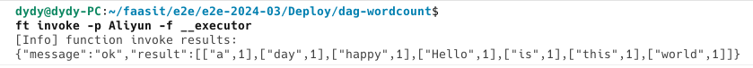

- 本地函数部署

```bash
cd func && ft deploy
```

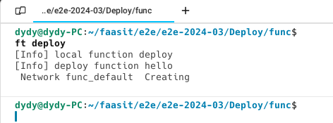

- 本地函数调用


```bash
cd func && ft invoke
```

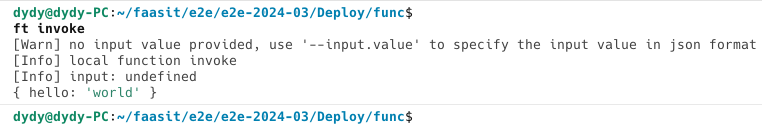

- 本地函数流部署

```bash
cd dag-wordcount && ft deploy
```

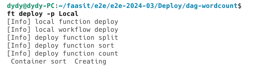

- 本地函数流调用

```bash
ft invoke -p Local -f executor
```

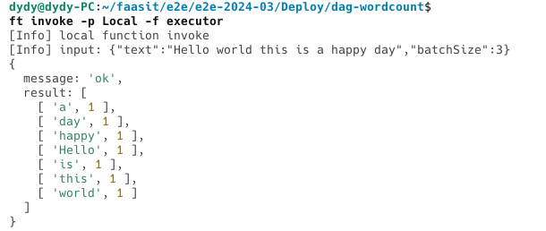


- 触发器创建

```bash
cd trigger && ft deploy
```

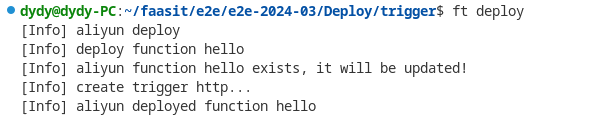


- 触发器更新

```bash
cd trigger && ft deploy
```

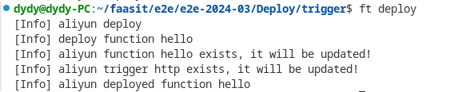


- 本地函数运行

```bash
cd python/demo1 && ft run
```

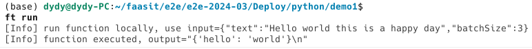


- 本地函数流执行

```bash
cd python/demo2 && ft run
```

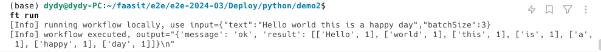