## 功能测试

1. 解析 Faasit 代码为抽象语法树

```sh
ft parse func/func_parse_ok.ft
```

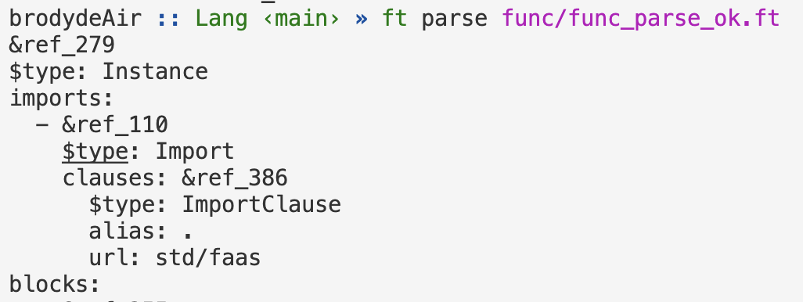

2. Faasit 代码语法错误检查

```sh
ft parse func/func_parse_failed.ft
```

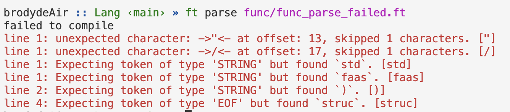

3. 解析Faasit代码为JS IR 对象

```sh
ft eval --ir func/func_eval_ir.ft
```

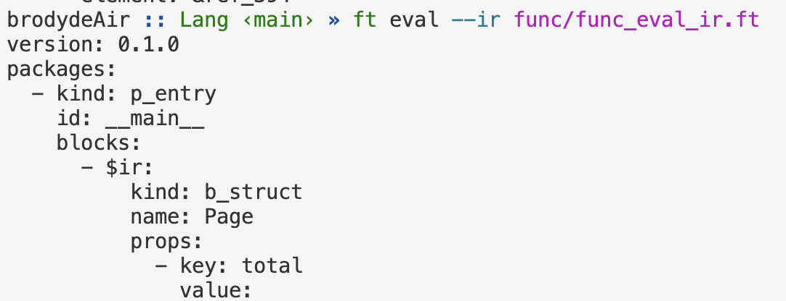

4. 解析Faasit代码为JS IR 对象并保存到文件

```sh
ft eval --ir func/func_eval_ir.ft -o func/func_eval_ir.yaml
```

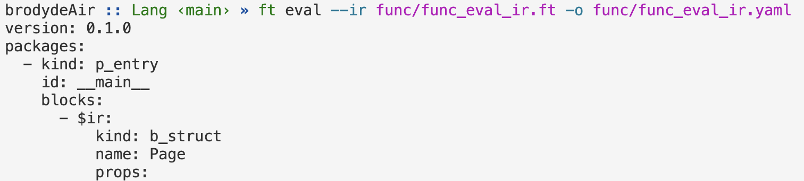

5. 解析Faasit代码为Value API对象

```sh
ft eval func/func_eval.ft
```

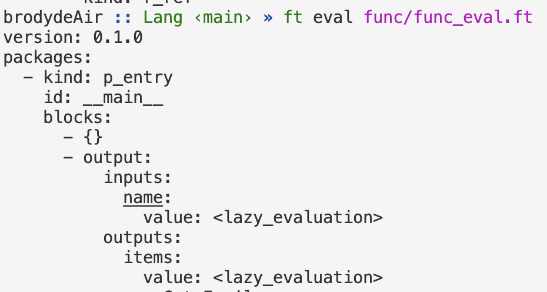

6. 解析Faasit代码为Value API对象并保存到文件

```sh
ft eval func/func_eval.ft -o func/func_eval.yaml
```

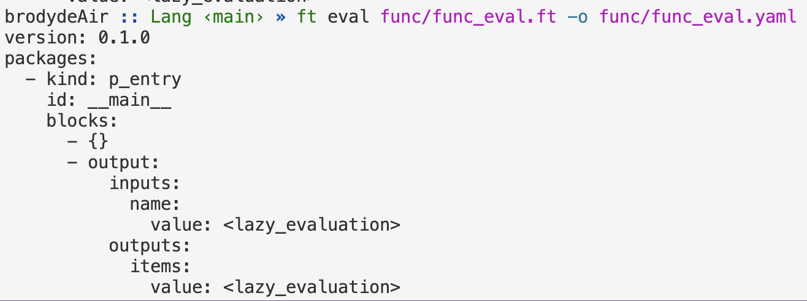

7. 添加变量/函数等存储在符号表中

```sh
ft dev-view --symbol-table func/func_dev-view_symbol-table.ft
```

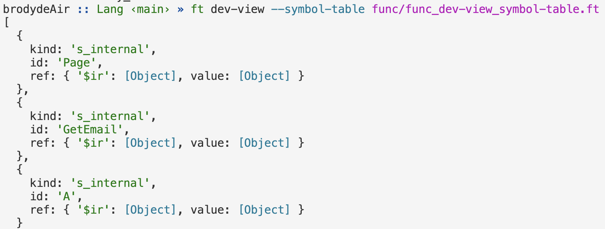

8. 尝试重复定义相同的符号，符号表能够正确地检测到重复定义

```sh
ft eval --check-symbols func/func_sema_conflict_symbol.ft
```

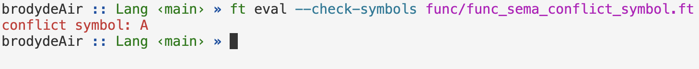

9. 自定义类型

```sh
ft eval func/func_eval.ft
```

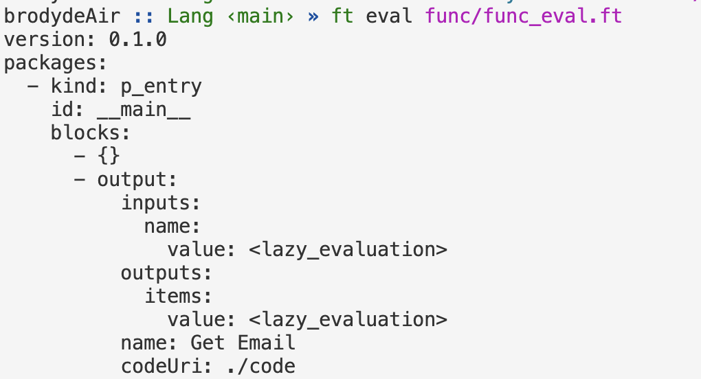

10. Javascript 事件定义代码生成

```sh
ft codegen func/func_codegen_def.ft
```

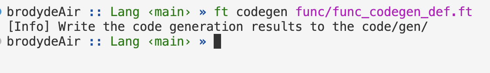

11. Javascript 事件类型代码生成

```sh
ft codegen func/func_codegen_types.ft
```

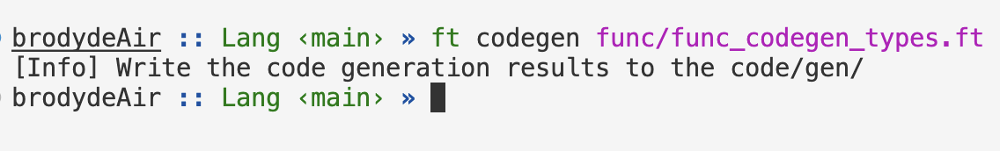

12. 自动补全包导入路径

```sh
code func/func_auto_import.ft
```

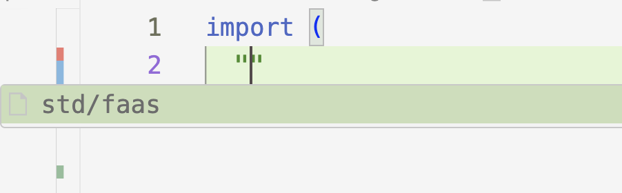

13. Faasit 代码格式化

```sh
ft fmt -p func/func_fmt.ft
```

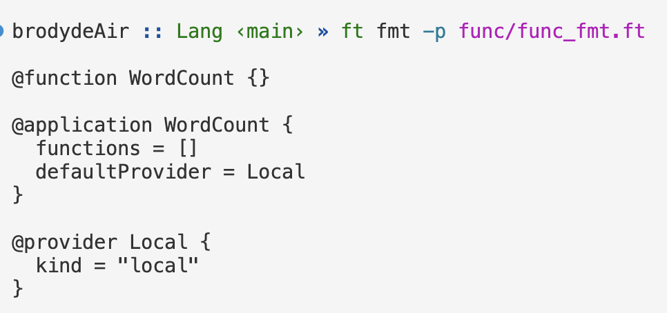

14. Faasit 代码语法高亮

```sh
code func/func_syntax_highlight.ft
```

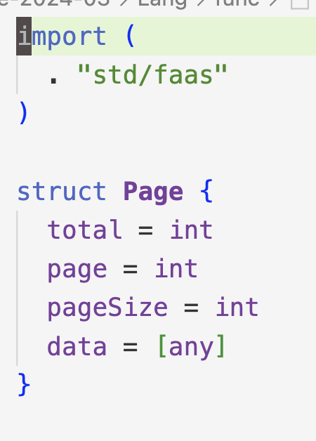

15. Faasit 代码错误提示

```sh
code func/func_error_hint.ft
```

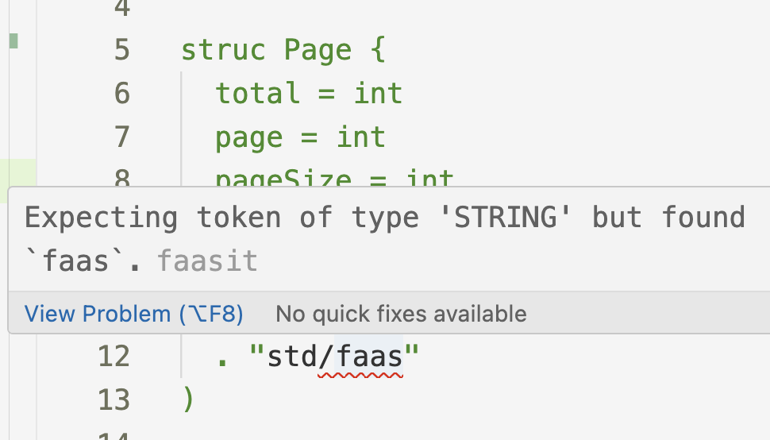

16. Faasit 代码悬浮提示

```sh
code func/func_hover_hint.ft
```

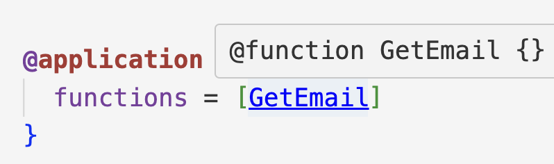

# 性能测试

1. 编译器语法分析模块

```sh
ft parse --dev_perf --no-stdout perf/perf_code.ft
```

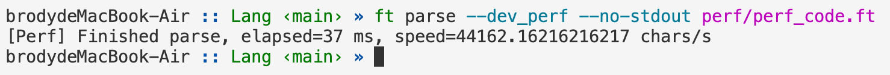

2. 编译器代码生成模块

```sh
ft codegen --dev_perf perf/perf_code.ft
```

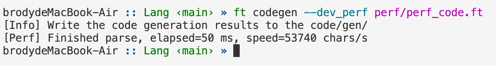

3. 语言服务模块

```sh
ft fmt --dev_perf perf/perf_code.ft
```

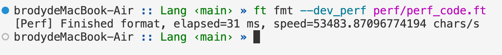
