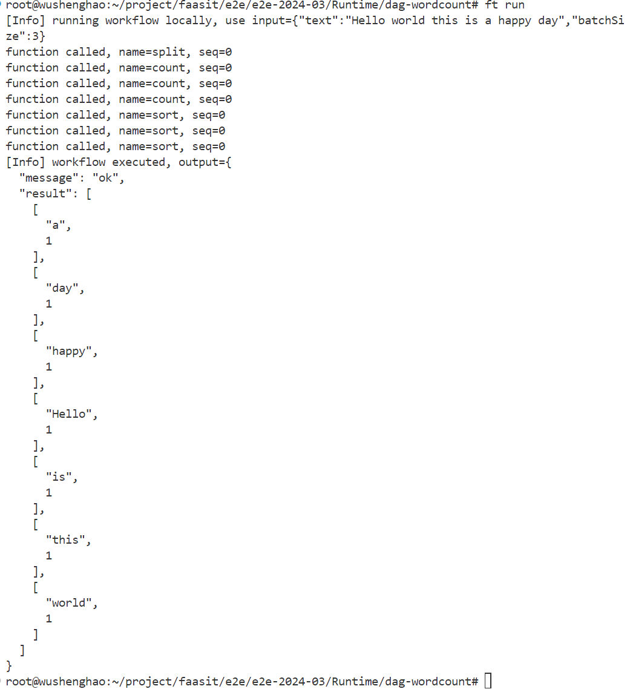
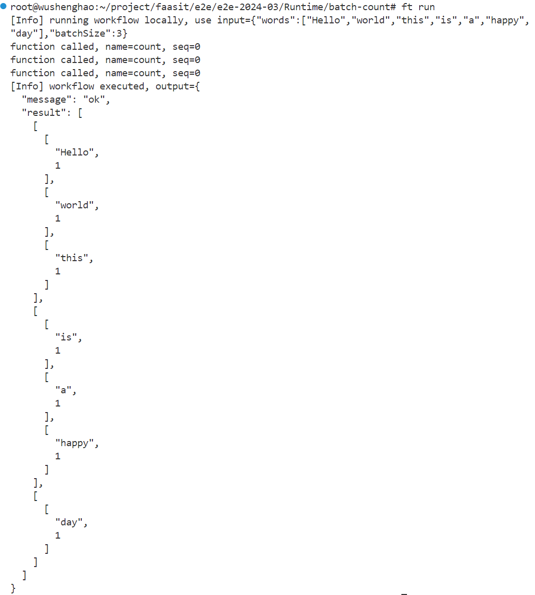
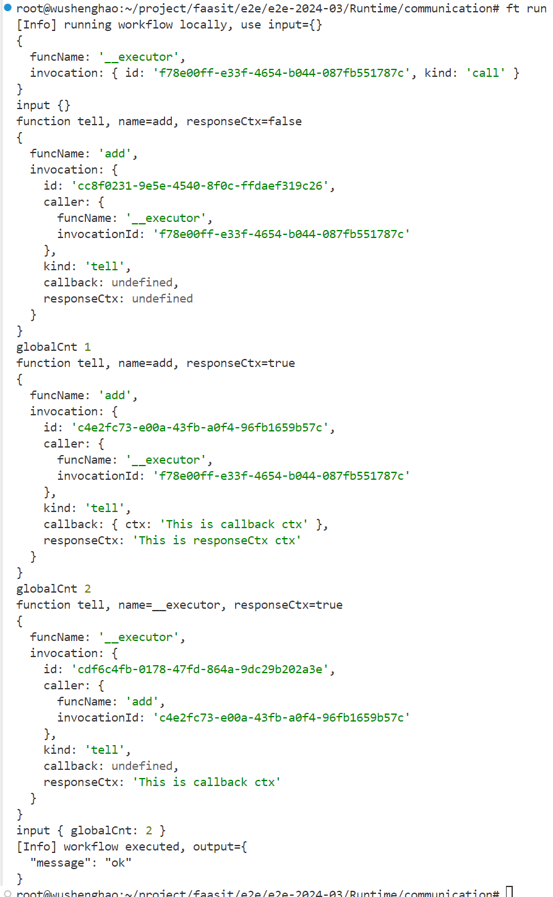

# 功能测试

## 测试样例

| 测试样例      | 测试过程                                  | 预期结果                                              | 覆盖功能点                                                   |
| ------------- | ----------------------------------------- | ----------------------------------------------------- | ------------------------------------------------------------ |
| dag-wordcount | 利用ft run运行测试样例                    | 词频统计返回正确结果                                  | **创建函数、导出接口、输入格式转换、输出格式转换、同步模式调用、创建工作流、数据分块并行处理** |
| batch-count   | 利用ft run运行测试样例                    | 能根据给定batchSize进行分组批量词频统计并返回正确结果 | 创建函数、导出接口、输入格式转换、输出格式转换、同步模式调用、创建工作流、**批量并行执行** |
| async-tell    | 利用ft run运行测试样例                    | 能够进行异步调用并返回调用者调用结果                  | 创建函数、导出接口、输出格式转换、**事件通知模式调用**、**异步模式调用**、**调用信息获取**、创建工作流 |
| dag-wordcount | 在阿里云、本地和Knative多平台上部署并运行 | 测试样例返回相同正确结果                              | **平台适配**                                                 |
|               |                                           |                                                       |                                                              |
|               |                                           |                                                       |                                                              |

## 测试结果截图

dag-wordcount

---------------------------

batch-count

-------------------

async-tell

-------------------

# 性能测试