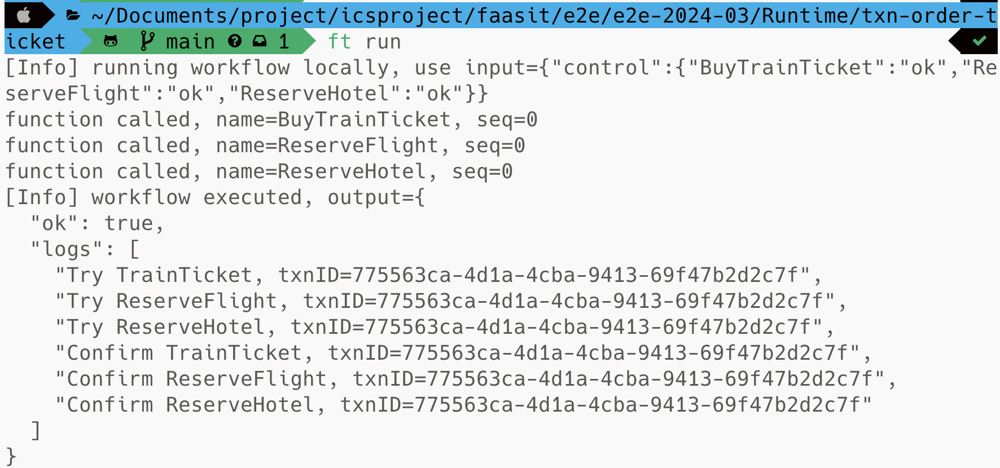
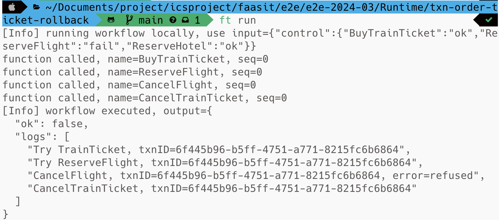
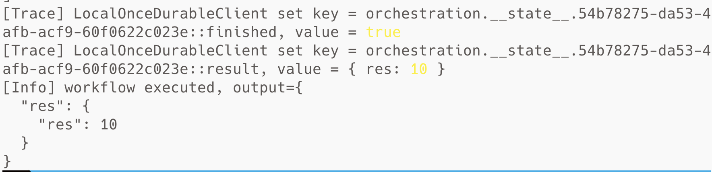
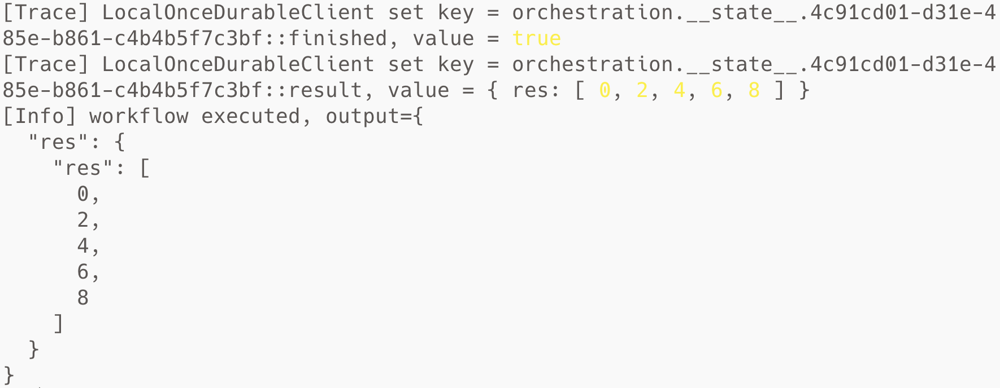
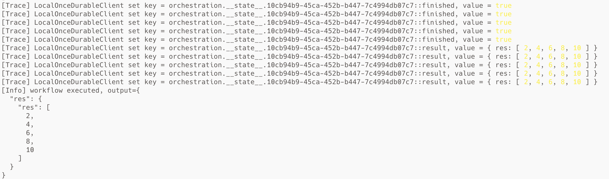
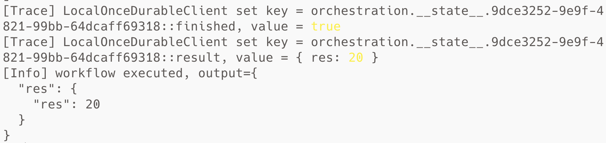

cd # 测试样例说明

| 测试样例      | 测试过程                               | 预期结果                                              | 覆盖功能点                                                   |
| ------------- | -------------------------------------- | ----------------------------------------------------- | ------------------------------------------------------------ |
| dag-wordcount | 进入目录，执行`ft run`本地运行测试样例 | 词频统计返回正确结果                                  | **创建函数、导出接口、输入格式转换、输出格式转换、**同步模式调用、创建工作流、**数据分块并行处理** |
| batch-count   | 进入目录，执行`ft run`本地运行测试样例 | 能根据给定batchSize进行分组批量词频统计并返回正确结果 | 创建函数、导出接口、输入格式转换、输出格式转换、**同步模式调用、创建工作流、批量并行执行** |
| async-tell    | 进入目录，执行`ft run`本地运行测试样例 | 能够进行异步调用并返回调用者调用结果                  | 创建函数、导出接口、输出格式转换、**事件通知模式调用**、**异步模式调用**、**调用信息获取**、创建工作流 |

# 功能测试

1. 创建函数

```sh
cd dag-wordcount && ft run && cd ..
```

2. 导出接口

```sh
cd dag-wordcount && ft run && cd ..
```

3. 输入格式转换

```sh
cd dag-wordcount && ft run && cd ..
```

4. 输出格式转换

```sh
cd dag-wordcount && ft run && cd ..
```

5. 同步模式调用

```sh
cd batch-count && ft run && cd ..
```

6. 事件通知模式调用

```sh
cd async-tell && ft run && cd ..
```

7. 异步模式调用

```sh
cd async-tell && ft run && cd ..
```

8. 调用信息获取

```sh
cd async-tell && ft run && cd ..
```

9. 创建工作流

```sh
cd batch-count && ft run && cd ..
```

10. 批量并行执行

```sh
cd batch-count && ft run && cd ..
```

11. 数据分块并行处理

```sh
cd dag-wordcount && ft run && cd ..
```


12. 分布式事务任务定义及管理

```sh
cd txn-order-ticket
cd javascript
npm i
cd ..
ft run
```

13. 分布式事务运行成功并提交

```sh
cd txn-order-ticket
cd javascript
npm i
cd ..
ft run
```

14. 分布式事务运行失败并回滚

```sh
cd txn-order-ticket-rollback
cd javascript
npm i
cd ..
ft run
```

15. 持久化链式任务函数执行

```sh
cd durable-chain
cd javascript
npm i
cd ..
ft run
```

16. 持久化循环任务函数执行

```sh
cd durable-loop
cd javascript
npm i
cd ..
ft run
```

17. 持久化并行任务函数执行

```sh
cd durable-parallel
cd javascript
npm i
cd ..
ft run
```

18. 持久化递归任务函数执行

```sh
cd durable-recursive
cd javascript
npm i
cd ..
ft run
```

# 性能测试

1. 函数声明模块

```sh
cd performance-declaration && node generateFakeArticle.js && ft run && cd ..
```

2. 函数通信模块

```sh
cd performance-invoke && ft run && cd ..
```

## 部分测试结果截图

dag-wordcount


---------------------------


batch-count


-------------------

async-tell


-------------------


txn-order-ticket



---------------------------

txn-order-ticket-rollback



---------------------------

durable-chain



---------------------------

durable-loop



---------------------------

durable-parallel



---------------------------

durable-recursive



